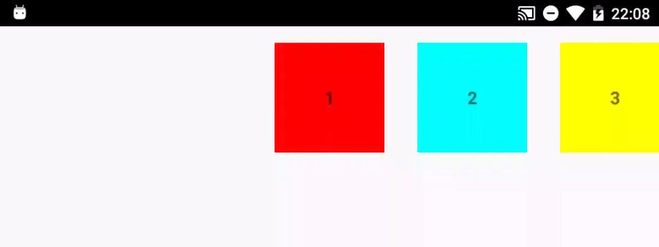
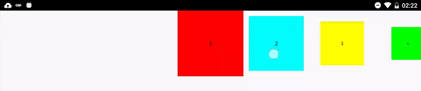

# Android SnappingRecyclerView

This is a simple implementation of a RecyclerView which allows views to snap to the center, much like the old Gallery.
This is a follow-up to this gist: [https://gist.github.com/lauw/fc84f7d04f8c54e56d56](https://gist.github.com/lauw/fc84f7d04f8c54e56d56).
Turned into a repository with some minor fixes/changes. 

If you have any suggestions or improvements, feel free to create an issue or a pull request.
Currently kept to a single-file implementation.

## Usage
-----
Simply copy the [SnappingRecyclerView class][1] into your project and implement it.
Check out the [Sample][2] for a full example on how to use it.

### Default

### Scaling views

## Known issues
------------
Changing orientation resets to wrong position.
  
  
## Future
-------
Will not be updating this repository, except for fixing minor issues that come up.  
Feel free to submit pull requests for issues or improvements.
Slowly working on a new version which is not hacked into RecyclerView.

## License
-------

Copyright 2015 Laurens Muller.

Licensed under the Apache License, Version 2.0 (the "License");
you may not use this file except in compliance with the License.
You may obtain a copy of the License at

    http://www.apache.org/licenses/LICENSE-2.0

Unless required by applicable law or agreed to in writing, software
distributed under the License is distributed on an "AS IS" BASIS,
WITHOUT WARRANTIES OR CONDITIONS OF ANY KIND, either express or implied.
See the License for the specific language governing permissions and
limitations under the License.

[1]: sample/src/main/java/com/muller/snappingsample/SnappingRecyclerView.java
[2]: sample
